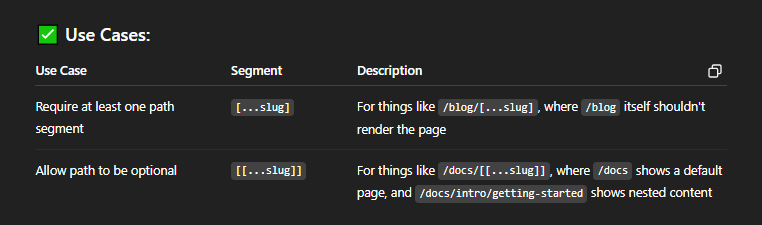

#### point to not is that any of the function can be an `async fucntion` or not it doesn't matter it its `Catch-all Segment` or `Optional Catch-all Segment`

# 🔹 1. Catch-all Segment: [...folderName]

# 🔹 2. Optional Catch-all Segment: [[...folderName]]

# Generating Static Params
